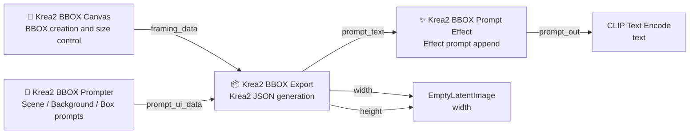
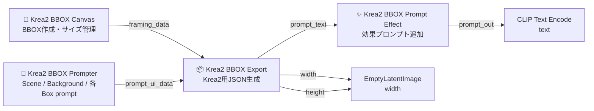

# Krea2 BBOX Prompter Suite

[日本語](#日本語)

**Krea2 BBOX Prompter Suite** is a ComfyUI custom node suite for manually drawing BBOX regions on a canvas and converting that layout into a structured prompt for Krea2.

You specify where each subject, object, or visible text region should appear, write prompts for each box, and export a JSON-style prompt that can be passed to Krea2.

BBOX regions are layout guidance for Krea2. They are not strict masks. Final placement still depends on the model, prompt wording, and the overall scene context.

---

## What This Node Can Do

- Draw BBOX regions manually to guide placement of people, objects, text, and other elements.
- Enter Object / Text prompts per colored slot.
  - Object: for visual elements such as people, objects, or scene parts.
  - Text: for visible text that should actually appear inside the image.
- Use `SCENE / BACKGROUND` to describe the overall image intent and environment.
- Add per-slot framing hints such as `Cowboy shot`, `Full body`, and `Upper body`.
- Add per-slot camera angle hints such as `Front view`, `Low angle`, and `Top-down view`.
- Generate a Krea2-oriented JSON prompt with the Export node.
- Connect `width` / `height` to `EmptyLatentImage` to keep the canvas size and generation size in sync.
- Add photographic, film, portrait, flash, art, lighting, and mood effects with the Prompt Effect node.
- Choose style presets from a thumbnail-card UI using local WebP thumbnails.

## Why Prompt Effect Matters

The Prompt Effect node is one of the most practical, and honestly **one of the most enjoyable**, parts of this suite. Krea2 responds surprisingly well to concise style and effect prompts, so these presets are **genuinely useful in practice**. Even small additions such as camera looks, lighting styles, color themes, film effects, or framing hints can noticeably change the final image.

This makes the node useful not only for decoration, but also for fast visual direction testing. You can quickly compare photo styles, camera effects, color themes, lighting moods, and composition hints without rewriting the whole prompt each time.

Prompt Effect presets are mainly tuned for Krea2 workflows that often lean photographic or real-world, but they are not meant to force every image into an ultra-realistic look. Presets that do not explicitly belong to anime, manga, comic, or illustration categories try to avoid pushing the result toward those styles; they focus more on **color grading, lighting, material feel, atmosphere, and background mood**.

Some effects may be weak or may not appear at all depending on the subject, background complexity, prompt conflicts, model interpretation, and the available visual space in the scene. Treat Prompt Effect as a fast direction tool, not a guaranteed fixed filter.

---

## First Steps

If a sample workflow is available, check:

```text
https://github.com/ukr8b3g-cmyk/Krea2-BBOX-Prompter/tree/main/workflow
```

Basic workflow:

```text
1. Set the image size in 📐 Krea2 BBOX Canvas.
2. Draw BBOX regions on the canvas.
3. Write prompts for each color slot in 📝 Krea2 BBOX Prompter.
4. Convert the layout and prompts into JSON with 📦 Krea2 BBOX Export.
5. Add photographic or style effects with ✨ Krea2 BBOX Prompt Effect.
6. Connect the final prompt to CLIP Text Encode.
```

---

## Recommended Node Connections



ASCII fallback:

```text
📐 Krea2 BBOX Canvas.framing_data
        ↓
📦 Krea2 BBOX Export.framing_data

📝 Krea2 BBOX Prompter.prompt_ui_data
        ↓
📦 Krea2 BBOX Export.prompt_ui_data

📦 Krea2 BBOX Export.prompt_text
        ↓
✨ Krea2 BBOX Prompt Effect.prompt_in
        ↓
✨ Krea2 BBOX Prompt Effect.prompt_out
        ↓
CLIP Text Encode.text

📦 Krea2 BBOX Export.width
        ↓
EmptyLatentImage.width

📦 Krea2 BBOX Export.height
        ↓
EmptyLatentImage.height
```

You do not need to connect Canvas directly to Prompter. Export combines the Canvas and Prompter data streams.

---

## Important: Which Prompt Effect Node to Use

Use this node:

```text
✨ Krea2 BBOX Prompt Effect
Internal ID: Krea2BBOXPromptEffect
```

Do not use the older node in new workflows:

```text
Deprecated:
✨ Krea2 Prompt Effect
Internal ID: Krea2PromptEffect
```

The older node may remain for compatibility with older workflows or other Krea2 suites, but new workflows should use `✨ Krea2 BBOX Prompt Effect`.

---

# Node List

## 📐 Krea2 BBOX Canvas

Canvas node for manually drawing BBOX regions.

Main roles:

- Set image size.
- Create BBOX regions.
- Move and resize BBOX regions.
- Manage color slots.
- Manage canvas presets.
- Output `framing_data`.

Main output:

```text
framing_data
```

---

## 📝 Krea2 BBOX Prompter

Prompt-entry node for each color slot on the canvas.

Main roles:

- Enter `SCENE / BACKGROUND`.
- Enter Object/Text prompts for each BBOX slot.
- Set framing hints.
- Set camera angle hints.
- Output `prompt_ui_data`.

Each slot includes:

```text
Prompt textarea
Type: Object / Text
Framing: Auto / Cowboy shot / Full body / Upper body / Bust-up / Headshot / Close-up / Lower body / Full object / Detail shot / Macro detail
Angle: Auto / Front view / POV / Side view / Low angle / High angle / Top-down view / Three-quarter view / Dutch angle / Over-the-shoulder / Rear view
```

Per-slot `Save`, `Load`, `Delete`, and top-right `X` controls are not shown. `Scene Preset` remains available for whole-scene text.

Main output:

```text
prompt_ui_data
```

---

## 📦 Krea2 BBOX Export

Combines Canvas BBOX data and Prompter prompt data into a Krea2 JSON prompt.

Main inputs:

```text
framing_data
prompt_ui_data
bbox_mode
output_format
output_mode
skip_empty
auto_position_hint
```

Main outputs:

```text
prompt_text
width
height
```

Normally, connect `prompt_text` to Prompt Effect or CLIP Text Encode.

---

## ✨ Krea2 BBOX Prompt Effect

Adds photographic, visual-style, or mood effect text after the JSON prompt.

Example presets:

```text
Realistic Photo
35mm Film
Cinematic Photo
Soft Portrait
Glamour Photo
Flash Photo
Direct Flash
Disposable Flash
B&W Soft
B&W Strong
Cyberpunk
Dark Fantasy
Watercolor
Product Photo
Food Photo
```

Main input:

```text
prompt_in
```

Main outputs:

```text
prompt_out
effect_text
```

Use `prompt_out` for normal generation. `effect_text` is for compatibility and inspection.

---

# Basic Usage

## 1. Set the Canvas Size

Choose the generation size in `📐 Krea2 BBOX Canvas`.

Examples:

```text
1024 x 1024
1024 x 1536
1536 x 1024
Custom
```

Also connect the Export node's `width` / `height` outputs to `EmptyLatentImage`.

---

## 2. Draw BBOX Regions

Select a color slot and draw BBOX regions on the canvas.

Available color slots:

```text
RED
BLUE
YELLOW
GREEN
MAGENTA
```

Each BBOX corresponds to the same color slot in Prompter.

```text
RED box   → red_prompt
BLUE box  → blue_prompt
GREEN box → green_prompt
```

---

## 3. Write Prompts in Prompter

Example:

```text
SCENE / BACKGROUND:
A professional office portrait composition.

BACKGROUND:
A bright modern office with soft daylight and clean interior details.

RED Object:
a young adult woman in a business suit sitting naturally, upper-body portrait, realistic skin texture

BLUE Object:
a small ID-photo style portrait of a person wearing glasses, blue background, no text
```

---

## 4. Choose Type

Each slot can be `Object` or `Text`.

### Object

Use this for people, objects, backgrounds, and visual elements.

```text
a young adult woman in a business suit sitting naturally, realistic skin texture
```

### Text

Use this only when you want visible text inside the generated image.

For visible-text work, it is usually safer to keep Text elements near the end of the final prompt flow. If text instructions appear too early, Krea2 may accidentally treat later descriptive words as part of the visible text.

```text
こんにちは | readable Japanese text with black outline
```

Example for a speech bubble:

```text
hello | comic panel, character speaking, speech bubble at the upper right, the speech bubble contains the exact text "hello"
```

The part before `|` is the visible text. The part after `|` describes its appearance.

```text
visible text | text appearance
```

---

## 5. Choose Framing

Framing helps describe how each Object should appear.

```text
Auto
Cowboy shot
Full body
Upper body
Bust-up
Headshot
Close-up
Lower body
Full object
Detail shot
Macro detail
```

Examples:

```text
Cowboy shot   → cowboy shot, framed from head to mid-thigh, full upper body visible, thighs partially visible
Full body     → shown as a full-body view
Upper body    → shown as an upper-body view
Bust-up       → shown as a bust-up portrait
Headshot      → shown as a headshot portrait
Close-up      → shown in a close-up view
Full object   → showing the full object
Detail shot   → shown as a detail shot
Macro detail  → shown as a macro detail view
```

---

## 6. Choose Angle

Angle helps describe the camera viewpoint for each Object.

```text
Auto
Front view
POV
Side view
Low angle
High angle
Top-down view
Three-quarter view
Dutch angle
Over-the-shoulder
Rear view
```

`Auto` adds no extra angle text. Avoid conflicting camera directions in the same slot, such as `Low angle` and `Top-down view`.

---

## 7. Export JSON Automatically

`📦 Krea2 BBOX Export` combines Canvas and Prompter data and emits JSON.

Example:

```json
{
  "aspect_ratio": "1:1",
  "high_level_description": "A professional office portrait composition.",
  "compositional_deconstruction": {
    "background": "A bright modern office with soft daylight and clean interior details.",
    "elements": [
      {
        "type": "obj",
        "bbox": [291, 40, 973, 973],
        "desc": "a young adult woman in a business suit sitting naturally, shown as an upper-body view, positioned in the middle-center area, occupying a large area"
      },
      {
        "type": "obj",
        "bbox": [27, 27, 261, 301],
        "desc": "a small ID-photo style portrait of a person wearing glasses, positioned in the upper-left area, occupying a small area"
      }
    ]
  }
}
```

---

## 8. Add Effects with Prompt Effect

`✨ Krea2 BBOX Prompt Effect` appends effect prompt text after the JSON prompt.

Examples:

```text
Soft Portrait
Glamour Photo
35mm Film
Flash Photo
B&W Strong
Cinematic Photo
```

Recommended for people:

```text
Soft Portrait
Glamour Photo
Beauty Photo
Editorial Portrait
Natural Light
Studio Light
```

Flash-style presets:

```text
Flash Photo
Direct Flash
Disposable Flash
Paparazzi Flash
```

`Disposable Flash` is useful for snapshot, party-photo, or rough documentary looks.

---

# Practical Tips

## Do Not Leave Scene / Background Empty

Krea2 needs overall context, not only BBOX regions.

Weak example:

```text
SCENE:
office

BACKGROUND:
```

Recommended:

```text
SCENE:
A professional office portrait composition with one main subject and a small ID-photo style inset.

BACKGROUND:
A bright modern office with soft daylight, clean desks, glass walls, and a calm professional atmosphere.
```

Background context helps prevent BBOX Objects from feeling isolated.

---

## Do Not Put Short Japanese Labels into Object

If an Object prompt is only a short Japanese word, Krea2 may render it as visible text.

Avoid:

```text
女子高生
新入社員
眼鏡
制服
猫
オフィス
```

Common problems:

```text
- Japanese characters appear in the image.
- Text becomes garbled.
- It is drawn like a label.
- Metadata such as bbox or obj becomes visible.
```

Recommended:

```text
a young adult office worker in a navy business suit, sitting naturally, realistic portrait lighting
```

Even when using Japanese, write descriptive sentences rather than short labels.

---

## Use Text Only for Visible Text

Use `Type = Text` only when you want actual visible text in the image.

```text
SALE | large red sale text with white outline
```

Japanese example:

```text
こんにちは | readable Japanese text with black outline
```

For speech bubbles:

```text
Hello! | speech bubble with clean outline, readable comic-style text
```

Short Japanese labels in Object prompts may be accidentally drawn as text.

---

## Avoid Strong Overlap Between Object BBOX Regions

Heavy overlap between Object regions can cause unwanted blending.

Common problems:

```text
- Extra people appear.
- Faces or bodies merge.
- Clothes or arms fuse with another Object.
- A small box is pulled into a large box.
- Added overlap areas are interpreted as another person or object.
```

Recommended:

```text
Object + Object:
Avoid large overlaps.

Object + Text:
Overlap is usually less risky.

Inset photo:
Write clear descriptions such as "small inset photo" or "ID-photo style inset".
```

---

## Keep auto_position_hint On

`auto_position_hint` adds position descriptions to `desc` from the BBOX location.

```text
positioned in the upper-left area, occupying a small area
positioned in the middle-center area, occupying a large area
```

Recommended:

```text
auto_position_hint: true
```

---

## BBOX Is Not a Strict Mask

BBOX is a strong composition hint, not a strict mask or ControlNet-style constraint.

Think of it this way:

```text
BBOX = strong composition hint
Prompt = content instruction
Scene / Background = overall context
Prompt Effect = photo/style correction
```

---

# Prompt Effect Presets

## Photo

```text
Realistic Photo
Cinematic Photo
Soft Portrait
B&W Soft
B&W Strong
Film Noir
Noir Photo
Vintage Photo
HDR Photo
Silhouette Photo
Glamour Photo
Landscape Photo
Street Photo
```

## Camera FX

```text
35mm Film
Flash Photo
Direct Flash
Disposable Flash
Paparazzi Flash
Dark Flash
Red Eye Flash
Polaroid
iPhone Photo
Tilt-Shift
Lens Distortion
Fisheye Lens
Chromatic Aberration
Long Exposure
Directional Blur
Toy Camera
Lomography
Night Vision
Security Camera
Thermal Camera
Film Negative
VHS
```

## Recommended for People

```text
Soft Portrait
Glamour Photo
Beauty Photo
Editorial Portrait
Candid Portrait
Natural Light
Studio Light
```

## Flash

```text
Flash Photo
Direct Flash
Disposable Flash
Paparazzi Flash
```

These flash presets are grouped under `Camera FX` in the UI.

## B&W / Noir

```text
B&W Soft
B&W Strong
Film Noir
Noir Photo
```

## Art

```text
Anime Clean
Anime Soft
Manga B&W
Illustration
Painterly
Watercolor
Oil Painting
Comic
Pixelate
Concept Art
```

## Light

```text
Natural Light
Studio Light
Golden Hour
Light Rays
Low Key
High Key
Neon Night
Cyberpunk
```

## Mood

```text
Dreamy
Dark Fantasy
High Detail
Minimal Clean
Retro Pop
```

## Finish

```text
Paper Print
Matte Print
Glossy Print
Canvas Texture
Fabric Print
Metal Print
Glass Print
Glass Distortion
Wet Surface
Water Droplets
Dusty Surface
Fractal Noise
Scratched Print
Vintage Paper
Stone Surface
Marble Finish
Concrete Finish
Rusty Metal
Aged Metal
Patina Finish
Wood Grain
Leather Finish
Ceramic Glaze
Plastic Finish
Slime Finish
Gel Finish
Liquid Gloss
Gummy Finish
Wax Finish
```

Finish presets add final surface and material-like effects such as paper, canvas, fabric, metal, glass, wet surfaces, dust, scratches, stone, rust, wood, leather, ceramic, plastic, slime, gel, gummy, and wax. Thumbnails are local WebP material swatches under `web/thumbnails/`.

## Color Theme

```text
Fantasy Color
Red Theme
Blue Theme
Pink Theme
Purple Theme
Green Theme
Yellow Theme
Orange Theme
Cyan Theme
Teal Theme
Magenta Theme
Warm Theme
Cool Theme
Pastel Theme
Neon Theme
Muted Theme
Monochrome Theme
Sepia Theme
Gold Theme
Silver Theme
Dark Theme
Bright Theme
Soft Theme
Vivid Theme
Earth Theme
Cream Theme
Lavender Theme
Mint Theme
Peach Theme
Rose Theme
Aqua Theme
Pastel Pink
Pastel Blue
Pastel Purple
Pastel Green
Pastel Yellow
Pastel Orange
Pastel Mint
Pastel Lavender
Pastel Peach
Pastel Rose
Pastel Aqua
Pastel Cream
Black & White
Red & Blue
Pink & Blue
Purple & Cyan
Orange & Teal
Yellow & Purple
Green & Magenta
Black & Red
Black & Gold
White & Blue
Pastel Pink & Blue
Pastel Mint & Lavender
Pastel Peach & Cream
Pastel Yellow & Green
Pastel Aqua & Pink
Crazy Color
Candy Color
Pop Color
Dreamy Color
Acid Color
Cyber Color
Rainbow Color
Holographic Color
Vaporwave Color
Stardust Fantasy
Shooting Star Fantasy
Galaxy Atmosphere
Aurora Mood
Dreamland Color
Heart Magic Color
Harajuku Decora Mood
Pastel Kawaii Mood
Pop Kawaii Color
Japanese Mood
Sakura Japan Color
Samurai Drama Color
Western Desert Color
Indian Festival Color
Arabian Night Color
Egyptian Gold Color
Chinese Lantern Color
Korean Pastel Color
Nordic Winter Color
Tropical Island Color
Virtual Diva Teal
Heterochromia Eyes
```

Color Theme presets apply broad palette direction such as single-color themes, two-color themes, pastel palettes, monochrome, neon, vaporwave, world-building color moods, and cultural or regional color moods such as Japanese, Western desert, Indian festival, Arabian night, Egyptian gold, Chinese lantern, Nordic winter, tropical island, and virtual diva teal. These mood presets often show up most clearly when the scene has a simple or open background, where Krea2 has room to reflect the palette and atmosphere. Thumbnails are included as local WebP color swatches under `web/thumbnails/`, including presets with `&` in the display name.

---

# Thumbnail Specification

- Runtime thumbnails are local WebP files.
- Keep them under `web/thumbnails/`.
- Keep `manifest.json` in the same folder as the thumbnails.
- Do not use GitHub raw URLs or external CDNs at runtime.
- Recommended final thumbnail size: `192 x 128 px`.
- Thumbnail display size is adjustable in the UI.
- Recommended display range: about `80-180 px`.
- Recommended file size: about `5-40 KB` per image.

Runtime path:

```text
/extensions/Krea2-BBOX-Prompter-Suite/web/thumbnails/<file>.webp
```

---

# Technical Specification

## Registered Node Names

```text
📐 Krea2 BBOX Canvas
📝 Krea2 BBOX Prompter
📦 Krea2 BBOX Export
✨ Krea2 BBOX Prompt Effect
```

## Internal IDs

```text
Krea2ElementFramingV1Canvas
Krea2ElementFramingV1Prompt
Krea2ElementJSONExportV1
Krea2BBOXPromptEffect
```

## Canvas Output

```json
{
  "width": 1024,
  "height": 1024,
  "boxes": [
    {
      "slot": "red",
      "bbox": [291, 40, 973, 973],
      "position_hint": "middle-center area"
    }
  ]
}
```

## Prompter Output

`prompt_ui_data` contains scene/background text and the prompts for each color slot.

## Export Input

```text
framing_data
prompt_ui_data
bbox_mode
output_format
output_mode
skip_empty
auto_position_hint
```

## Export Output

```text
prompt_text
width
height
```

## bbox_mode

### normalized_1000

Converts coordinates into a 0-1000 normalized space.

```text
x_normalized = round(x / width * 1000)
y_normalized = round(y / height * 1000)
```

### pixel

Outputs actual pixel coordinates.

```text
[x1, y1, x2, y2]
```

## Output JSON

The Export node emits JSON-style prompt text with:

```text
aspect_ratio
high_level_description
compositional_deconstruction
background
elements
type
bbox
desc
```

## Text Auto Detection

The Prompter can separate visible text and appearance instructions with:

```text
visible text | appearance description
```

## Prompt Effect Output

```text
prompt_out   = prompt_in + selected effect text
effect_text  = selected effect text only
```

`effect_text` exists for compatibility and inspection.

---

# Detailed Technical Notes

- `framing_data` stores canvas size, boxes, active slot, visibility state, draw mode, guide mode, UI language, and camera data.
- `prompt_ui_data` stores scene/background text and per-slot prompt/type/framing/angle data.
- Export merges `framing_data` and `prompt_ui_data`.
- BBOX coordinates are clamped to the canvas.
- Empty or invalid boxes are skipped.
- `auto_position_hint` adds natural-language position and size hints.
- Framing options append helper phrases such as cowboy shot, upper-body, bust-up, headshot, detail shot, and macro detail.
- Angle options append helper phrases such as front view, low angle, top-down view, and over-the-shoulder view.
- `skip_empty` skips empty slot prompts.
- `output_format` and `output_mode` are kept for compatibility.
- `aspect_ratio` is calculated from `width` and `height`.
- Export `width` / `height` should be connected to `EmptyLatentImage`.
- Web UI state is stored in workflow/node state, while user presets may use browser local storage.
- Thumbnail loading uses local extension paths and falls back to text/gradient cards if a file is missing.
- Keep backup `.js` files out of `web`; ComfyUI may load every JavaScript file in that folder as an active extension script.
- This suite does not include an LLM. It only structures user-written prompt text.

---

# Installation

From your ComfyUI `custom_nodes` folder:

```powershell
cd D:\Codex\ComfyUI\custom_nodes
git clone https://github.com/ukr8b3g-cmyk/Krea2-BBOX-Prompter.git Krea2-BBOX-Prompter-Suite
```

If the folder already exists, update it instead:

```powershell
cd D:\Codex\ComfyUI\custom_nodes\Krea2-BBOX-Prompter-Suite
git pull
```

Then restart ComfyUI and hard refresh the browser if the old UI is still cached:

```text
Ctrl + F5
```

---

# Avoid Double-Nested Folders

Correct:

```text
ComfyUI/custom_nodes/Krea2-BBOX-Prompter-Suite/
  __init__.py
  nodes_element_framing.py
  web/
```

Incorrect:

```text
ComfyUI/custom_nodes/Krea2-BBOX-Prompter-Suite/Krea2-BBOX-Prompter-Suite/
  __init__.py
```

---

# Known Limitations

## No LLM

This node suite does not rewrite or improve prompts automatically. It only organizes and exports your manually written prompt text.

## Depends on Krea2 Interpretation

BBOX placement is not guaranteed to be exact. Use clear scene context, descriptive Object prompts, and minimal overlap for better results.

---

# Recommended Workflow

```text
Canvas
  ↓
Prompter
  ↓
Export
  ↓
Prompt Effect
  ↓
CLIP Text Encode
```

---

# License

Repository license applies.

---

# Repository

```text
https://github.com/ukr8b3g-cmyk/Krea2-BBOX-Prompter
```

---

# 日本語

# Krea2 BBOX Prompter Suite

**Krea2 BBOX Prompter Suite** は、ComfyUI上で手動でBBOX（ボックス）を描き、そのレイアウト情報を使ってKrea2向けの構造化プロンプトを作るカスタムノードです。

画像の中に「どこに何を置きたいか」をCanvas上で指定し、それぞれのボックスにプロンプトを書き、最後にKrea2へ渡すJSON形式のプロンプトへ変換します。

ただし、BBOXはあくまでKrea2へのレイアウト指示です。モデルの性能やプロンプトの内容に依存するため、配置が常に厳密に再現されるわけではありません。

---

## このノードでできること

- 手動でBBOXを描いて、人物・物体・文字などの配置を指定できます。
- 色付きスロットごとに Object / Text のプロンプトを入力できます。
  - Object：人物や物体など「画像として描かせたい要素」に使います。
  - Text：画像内に実際に表示したい文字（看板・ロゴ・テキスト）に使います。
- `SCENE / BACKGROUND` で画像全体の意図や背景を指定できます。
- `Cowboy shot`、`Full body`、`Upper body` などのFraming補助を色スロットごとに指定できます。
- `Front view`、`Low angle`、`Top-down view` などのアングル補助を色スロットごとに指定できます。
- ExportノードでKrea2向けのJSONプロンプトを生成できます。
- `width` / `height` を `EmptyLatentImage` に接続して、Canvasサイズと生成サイズを同期できます。
- Prompt Effectノードを使って、写真風・フィルム風・ポートレート風・フラッシュ風などの効果プロンプトを追加できます。
- スタイル選択にはWebPサムネイル付きのカードUIを使えます。

## Prompt Effectが使える理由

作者目線では、このスイートの中でもPrompt Effectノードが**一番楽しい部分**です。Krea2は短いスタイル指定やエフェクト指定にも意外とよく追従するため、これらのプリセットは**実際にかなり使えます**。カメラ風、ライティング、カラーテーマ、フィルム風、構図補助などを少し加えるだけでも、最終画像の印象がかなり変わります。

単なる装飾用ではなく、画作りの方向性を素早く試すためのノードとして使えます。毎回プロンプト全体を書き直さなくても、写真スタイル、カメラFX、色テーマ、光の雰囲気、構図のヒントを切り替えながら比較できます。

---

## まず最初に：このノードの使い方

サンプルワークフローがある場合は、以下を確認してください。

```text
https://github.com/ukr8b3g-cmyk/Krea2-BBOX-Prompter/tree/main/workflow
```

基本的な流れは以下です。

```text
1. 📐 Krea2 BBOX Canvas で画像サイズを決める
2. Canvas上にBBOXを描く
3. 📝 Krea2 BBOX Prompter で各色スロットにプロンプトを書く
4. 📦 Krea2 BBOX Export でJSONプロンプトに変換する
5. ✨ Krea2 BBOX Prompt Effect で写真効果や画風効果を追加する
6. CLIP Text Encode に接続して生成する
```

---

## 推奨ノード接続

### 基本チャート



### ASCII接続図

```text
📐 Krea2 BBOX Canvas.framing_data
        ↓
📦 Krea2 BBOX Export.framing_data

📝 Krea2 BBOX Prompter.prompt_ui_data
        ↓
📦 Krea2 BBOX Export.prompt_ui_data

📦 Krea2 BBOX Export.prompt_text
        ↓
✨ Krea2 BBOX Prompt Effect.prompt_in
        ↓
✨ Krea2 BBOX Prompt Effect.prompt_out
        ↓
CLIP Text Encode.text

📦 Krea2 BBOX Export.width
        ↓
EmptyLatentImage.width

📦 Krea2 BBOX Export.height
        ↓
EmptyLatentImage.height
```

CanvasをPrompterへ直接つなぐ必要はありません。CanvasとPrompterの情報はExportで統合します。

---

## 重要：使うべきPrompt Effect

現在推奨するのは以下です。

```text
✨ Krea2 BBOX Prompt Effect
内部ID: Krea2BBOXPromptEffect
```

旧ノード名の `✨ Krea2 Prompt Effect` が表示される場合がありますが、新規ワークフローでは使用しないでください。

```text
非推奨:
✨ Krea2 Prompt Effect
内部ID: Krea2PromptEffect
```

旧ノードは、旧ワークフローや別スイートとの互換目的で残っている場合があります。新しく作る場合は `✨ Krea2 BBOX Prompt Effect` を使ってください。

---

# ノード一覧

## 📐 Krea2 BBOX Canvas

BBOXを手動で描くCanvasノードです。

主な役割：

- 画像サイズの指定
- BBOXの作成
- BBOXの移動・リサイズ
- 色スロットの管理
- Canvasプリセットの管理
- `framing_data` の出力

主な出力：

```text
framing_data
```

---

## 📝 Krea2 BBOX Prompter

Canvas上の各色スロットに対してプロンプトを入力するノードです。

主な役割：

- `SCENE / BACKGROUND` の入力
- 各BBOXスロットのObject/Text入力
- Framing指定
- Angle指定
- `prompt_ui_data` の出力

各スロットには以下があります。

```text
Prompt textarea
Type: Object / Text
Framing: Auto / Cowboy shot / Full body / Upper body / Bust-up / Headshot / Close-up / Lower body / Full object / Detail shot / Macro detail
Angle: Auto / Front view / POV / Side view / Low angle / High angle / Top-down view / Three-quarter view / Dutch angle / Over-the-shoulder / Rear view
```

各色カード内の `Save`、`Load`、`Delete`、右上の `X` は表示しません。`Scene Preset` はシーン全体のテキスト用として残しています。

主な出力：

```text
prompt_ui_data
```

---

## 📦 Krea2 BBOX Export

CanvasのBBOX情報とPrompterのプロンプト情報を統合して、Krea2向けJSONプロンプトを生成します。

主な入力：

```text
framing_data
prompt_ui_data
bbox_mode
output_format
output_mode
skip_empty
auto_position_hint
```

主な出力：

```text
prompt_text
width
height
```

通常は `prompt_text` を Prompt Effect または CLIP Text Encode へ接続します。

---

## ✨ Krea2 BBOX Prompt Effect

Exportから出たJSONプロンプトに、写真効果・画風効果・雰囲気効果を追加するノードです。

主な役割：

- Realistic Photo
- 35mm Film
- Cinematic Photo
- Soft Portrait
- Glamour Photo
- Flash Photo
- Direct Flash
- Disposable Flash
- B&W Soft
- B&W Strong
- Cyberpunk
- Dark Fantasy
- Watercolor
- Product Photo
- Food Photo

などの効果プロンプトを追加します。

主な入力：

```text
prompt_in
```

主な出力：

```text
prompt_out
effect_text
```

通常使用するのは `prompt_out` です。  
`effect_text` は互換用・確認用です。

---

# 基本操作

## 1. Canvasでサイズを決める（ユーザープリセット保存あり）

`📐 Krea2 BBOX Canvas` で生成サイズを選びます。

例：

```text
1024 x 1024
1024 x 1536
1536 x 1024
Custom
```

Krea2生成用の `EmptyLatentImage` にも、Exportから出る `width` / `height` を接続してください。

---

## 2. CanvasにBBOXを描く

Canvas上で色スロットを選んでBBOXを描きます。

利用できる色スロット：

```text
RED
BLUE
YELLOW
GREEN
MAGENTA
```

各BBOXは、Prompter側の同じ色スロットと対応します。

例：

```text
RED box   → red_prompt
BLUE box  → blue_prompt
GREEN box → green_prompt
```

---

## 3. Prompterにプロンプトを書く

`📝 Krea2 BBOX Prompter` で各スロットに説明を書きます。

例：

```text
SCENE / BACKGROUND:
A professional office portrait composition.

BACKGROUND:
A bright modern office with soft daylight and clean interior details.

RED Object:
a young adult woman in a business suit sitting naturally, upper-body portrait, realistic skin texture

BLUE Object:
a small ID-photo style portrait of a person wearing glasses, blue background, no text
```

---

## 4. Typeを選ぶ

各スロットには `Object` と `Text` があります。

### Object

人物・物体・背景要素など、画像として描きたいものに使います。

```text
a young adult woman in a business suit sitting naturally, realistic skin texture
```

### Text

画像内に実際に表示したい文字に使います。

文字系の指示は、最終プロンプトの後ろ寄りに置く方が安全です。上の方に置くと、その後ろに続く通常の説明文までKrea2が表示文字として拾ってしまう可能性があります。

```text
こんにちは | readable Japanese text with black outline
```

Textでは `|` の前が表示文字、後ろが見た目の説明です。

```text
表示文字 | 文字の見た目
```

---

## 5. Framingを選ぶ

Framingは、各Objectの見え方を補助する指定です。

選択肢：

```text
Auto
Cowboy shot
Full body
Upper body
Bust-up
Headshot
Close-up
Lower body
Full object
Detail shot
Macro detail
```

例：

```text
Cowboy shot   → cowboy shot, framed from head to mid-thigh, full upper body visible, thighs partially visible
Full body     → shown as a full-body view
Upper body    → shown as an upper-body view
Bust-up       → shown as a bust-up portrait
Headshot      → shown as a headshot portrait
Close-up      → shown in a close-up view
Full object   → showing the full object
Detail shot   → shown as a detail shot
Macro detail  → shown as a macro detail view
```

---

## 6. Angleを選ぶ

Angleは、各Objectのカメラ視点を補助する指定です。

```text
Auto
Front view
POV
Side view
Low angle
High angle
Top-down view
Three-quarter view
Dutch angle
Over-the-shoulder
Rear view
```

`Auto` はアングル補助を追加しません。同じスロット内で `Low angle` と `Top-down view` のような矛盾する視点指定は避けてください。

---

## 7. ExportでJSONを自動生成する

`📦 Krea2 BBOX Export` は、CanvasとPrompterを統合してJSONを出します。

出力例：

```json
{
  "aspect_ratio": "1:1",
  "high_level_description": "A professional office portrait composition.",
  "compositional_deconstruction": {
    "background": "A bright modern office with soft daylight and clean interior details.",
    "elements": [
      {
        "type": "obj",
        "bbox": [291, 40, 973, 973],
        "desc": "a young adult woman in a business suit sitting naturally, shown as an upper-body view, positioned in the middle-center area, occupying a large area"
      },
      {
        "type": "obj",
        "bbox": [27, 27, 261, 301],
        "desc": "a small ID-photo style portrait of a person wearing glasses, positioned in the upper-left area, occupying a small area"
      }
    ]
  }
}
```

---

## 8. Prompt Effectで効果を追加する（ON / OFF）

`✨ Krea2 BBOX Prompt Effect` を使うと、JSONプロンプトの後ろに効果プロンプトを追加できます。

例：

```text
Soft Portrait
Glamour Photo
35mm Film
Flash Photo
B&W Strong
Cinematic Photo
```

### 人物生成でおすすめ

人物を自然に見せたい場合は、以下が使いやすいです。

```text
Soft Portrait
Glamour Photo
Beauty Photo
Editorial Portrait
Natural Light
Studio Light
```

これらは、人物の肌・光・ポートレート感を整える方向の効果です。

### 面白い効果

フラッシュ系は、写ルンですやコンパクトカメラでフラッシュを焚いたような雰囲気が出ます。

```text
Flash Photo
Direct Flash
Disposable Flash
Paparazzi Flash
```

特に `Disposable Flash` は、スナップ写真・パーティー写真・少しラフな記録写真風に使えます。

---

# 実用Tips

## Scene / Background は空にしない

Krea2では、BBOXだけでなく全体の文脈も重要です。

弱い例：

```text
SCENE:
オフィス

BACKGROUND:
```

推奨例：

```text
SCENE:
A professional office portrait composition with one main subject and a small ID-photo style inset.

BACKGROUND:
A bright modern office with soft daylight, clean desks, glass walls, and a calm professional atmosphere.
```

背景情報があると、BBOX内のObjectが孤立しにくくなります。

---

## 短い日本語ラベルだけをObjectに入れない

Object promptに短い日本語単語だけを書くと、Krea2がそれを文字として画像内に描いてしまう場合があります。

避けたい例：

```text
女子高生
新入社員
眼鏡
制服
猫
オフィス
```

起きやすい問題：

```text
- 日本語文字が画像に出る
- 文字化けする
- ラベルのように描画される
- bboxやobjなどのメタ情報が見える
```

推奨：

```text
a young adult office worker in a navy business suit, sitting naturally, realistic portrait lighting
```

日本語を使いたい場合でも、Objectでは短いラベルではなく、できるだけ説明文にしてください。

---

## 画像内に文字を出したい場合だけ Text を使う

可視文字を出したい場合は `Type = Text` を使います。

例：

```text
SALE | large red sale text with white outline
```

日本語文字の場合：

```text
こんにちは | readable Japanese text with black outline
```

吹き出しを使いたい場合は、以下のように `speech bubble` を指定すると効果的です。

```text
Hello! | speech bubble with clean outline, readable comic-style text
```

逆に、Objectで日本語単語だけを書くと、それが誤って画像内に描かれる可能性があります。

---

## Object同士のBBOXを強く重ねない

ObjectのBBOX同士をクロスオーバーさせると、追加分の領域が人物や物体として描かれてしまう場合があります。

起きやすい問題：

```text
- 人物が増える
- 顔や体が混ざる
- 服や腕が別のObjectと融合する
- 小さいボックスの内容が大きいボックス側に引っ張られる
- BBOXの追加部分が別人物として描かれる
```

推奨：

```text
Object + Object:
なるべく大きく重ねない

Object + Text:
重ねても比較的問題が少ない

Inset photo:
明確に "small inset photo" や "ID-photo style inset" と書く
```

---

## auto_position_hint はON推奨

`auto_position_hint` をONにすると、BBOX位置から自動的に位置説明がdescへ追加されます。

例：

```text
positioned in the upper-left area, occupying a small area
positioned in the middle-center area, occupying a large area
```

これはKrea2がBBOX位置を解釈する補助になります。

推奨：

```text
auto_position_hint: true
```

---

## BBOXは厳密なマスクではない

BBOXは、Krea2に「このあたりにこの要素を置く」という指示を渡すものです。  
マスクやControlNetのような厳密な拘束ではありません。

そのため、以下のように考えると扱いやすいです。

```text
BBOX = 強い構図ヒント
Prompt = 内容の指定
Scene / Background = 全体文脈
Prompt Effect = 写真・画風の補正
```

---

# Prompt Effectプリセットの使い分け

## Photo系

```text
Realistic Photo
Cinematic Photo
Soft Portrait
B&W Soft
B&W Strong
Film Noir
Noir Photo
Vintage Photo
HDR Photo
Silhouette Photo
Glamour Photo
Landscape Photo
Street Photo
```

## Camera FX系

```text
35mm Film
Flash Photo
Direct Flash
Disposable Flash
Paparazzi Flash
Dark Flash
Red Eye Flash
Polaroid
iPhone Photo
Tilt-Shift
Long Exposure
Toy Camera
Lomography
Night Vision
Security Camera
Thermal Camera
Film Negative
VHS
```

## 人物向けおすすめ

```text
Soft Portrait
Glamour Photo
Beauty Photo
Editorial Portrait
Candid Portrait
Natural Light
Studio Light
```

人物の肌、光、ポートレート感を整えたい時に使います。

## フラッシュ系

```text
Flash Photo
Direct Flash
Disposable Flash
Paparazzi Flash
```

写ルンです、古いコンパクトカメラ、パーティースナップ、夜の路上スナップのような面白い効果を出したい時に使えます。

UI上ではこれらのフラッシュ系プリセットは `Camera FX` に分類されます。

## B&W / Noir系

```text
B&W Soft
B&W Strong
Film Noir
Noir Photo
```

白黒写真、ハイコントラスト、映画的な陰影を作りたい時に使います。

## Art系

```text
Anime Clean
Anime Soft
Manga B&W
Illustration
Painterly
Watercolor
Oil Painting
Comic
Pixelate
Concept Art
```

写真ではなくイラスト系に寄せたい時に使います。

## Light系

```text
Natural Light
Studio Light
Golden Hour
Low Key
High Key
Neon Night
Cyberpunk
```

光の印象を変えたい時に使います。

## Mood系

```text
Dreamy
Dark Fantasy
High Detail
Minimal Clean
Retro Pop
```

全体の雰囲気を変えたい時に使います。

## Color Theme系

```text
Fantasy Color
Red Theme
Blue Theme
Pink Theme
Purple Theme
Green Theme
Yellow Theme
Orange Theme
Cyan Theme
Teal Theme
Magenta Theme
Warm Theme
Cool Theme
Pastel Theme
Neon Theme
Muted Theme
Monochrome Theme
Sepia Theme
Gold Theme
Silver Theme
Dark Theme
Bright Theme
Soft Theme
Vivid Theme
Earth Theme
Cream Theme
Lavender Theme
Mint Theme
Peach Theme
Rose Theme
Aqua Theme
Pastel Pink
Pastel Blue
Pastel Purple
Pastel Green
Pastel Yellow
Pastel Orange
Pastel Mint
Pastel Lavender
Pastel Peach
Pastel Rose
Pastel Aqua
Pastel Cream
Black & White
Red & Blue
Pink & Blue
Purple & Cyan
Orange & Teal
Yellow & Purple
Green & Magenta
Black & Red
Black & Gold
White & Blue
Pastel Pink & Blue
Pastel Mint & Lavender
Pastel Peach & Cream
Pastel Yellow & Green
Pastel Aqua & Pink
Crazy Color
Candy Color
Pop Color
Dreamy Color
Acid Color
Cyber Color
Rainbow Color
Holographic Color
Vaporwave Color
Stardust Fantasy
Shooting Star Fantasy
Galaxy Atmosphere
Aurora Mood
Dreamland Color
Heart Magic Color
Harajuku Decora Mood
Pastel Kawaii Mood
Pop Kawaii Color
Japanese Mood
Sakura Japan Color
Samurai Drama Color
Western Desert Color
Indian Festival Color
Arabian Night Color
Egyptian Gold Color
Chinese Lantern Color
Korean Pastel Color
Nordic Winter Color
Tropical Island Color
Virtual Diva Teal
Heterochromia Eyes
```

単色テーマ、二色テーマ、パステル、白黒、ネオン、Vaporwave、お遊び系など、画面全体の配色傾向を変えるためのプリセットです。サムネイルは `web/thumbnails/` に同梱されたローカルWebPカラースウォッチを使用します。

---

# サムネイル仕様

Prompt EffectのプリセットカードにはWebPサムネイルを使用できます。

保存先：

```text
web/thumbnails/
```

形式：

```text
WebP
```

推奨サイズ：

```text
192 x 128 px
```

表示想定：

```text
UI上で調整可能
推奨範囲: 約80〜180 px
```

方針：

```text
- 外部URLから取得しない
- GitHub rawに依存しない
- custom_nodes内のローカルファイルとして同梱する
- 画像がない場合は文字カードにフォールバックする
```

---

# 技術仕様

## ノード登録名

```text
📐 Krea2 BBOX Canvas
📝 Krea2 BBOX Prompter
📦 Krea2 BBOX Export
✨ Krea2 BBOX Prompt Effect
```

旧互換用として以下が表示される場合があります。

```text
✨ Krea2 Prompt Effect
```

ただし新規利用ではバグの原因となる可能性があるため非推奨です。

---

## 内部ID

```text
Krea2ElementFramingV1Canvas
Krea2ElementFramingV1Prompt
Krea2ElementJSONExportV1
Krea2BBOXPromptEffect
```

旧互換用：

```text
Krea2PromptEffect
```

---

## Canvas出力

```text
framing_data: KREA2_ELEMENT_FRAMING_DATA
```

内容：

```json
{
  "version": "krea2_element_framing_v1",
  "width": 1024,
  "height": 1024,
  "preset": "1024 x 1024",
  "layout": {
    "boxes": []
  },
  "camera": {},
  "grid_mode": "Thirds",
  "ui_language": "Auto"
}
```

---

## Prompter出力

```text
prompt_ui_data: KREA2_ELEMENT_PROMPT_DATA
```

内容：

```json
{
  "version": "krea2_element_prompt_ui_v1",
  "scene": "",
  "background": "",
  "slots": {
    "red": {
      "type": "obj",
      "prompt": "",
      "framing": "Auto"
    }
  }
}
```

---

## Export入力

```text
framing_data
prompt_ui_data
bbox_mode
output_format
output_mode
skip_empty
auto_position_hint
```

`output_format` と `output_mode` は旧ワークフロー互換用です。  
現在の実出力は基本的にcompact JSONです。

---

## Export出力

```text
prompt_text: STRING
width: INT
height: INT
```

---

## bbox_mode

```text
normalized_1000
pixel
```

### normalized_1000

Canvas上のピクセル座標を0〜1000へ正規化します。

```text
[x1, y1, x2, y2]
```

メリット：

```text
- 解像度に依存しにくい
- 異なるサイズでも同じ構図を再利用しやすい
- JSONが短くなる
- Krea2用のレイアウト指定として扱いやすい
```

通常は以下を推奨します。

```text
bbox_mode: normalized_1000
```

### pixel

Canvas上のピクセル座標をそのまま使います。

```text
[x1, y1, x2, y2]
```

用途：

```text
- デバッグ
- 実ピクセル座標の確認
- 特定サイズ固定のワークフロー
```

---

## 出力JSON形式

```json
{
  "aspect_ratio": "1:1",
  "high_level_description": "...",
  "compositional_deconstruction": {
    "background": "...",
    "elements": [
      {
        "type": "obj",
        "bbox": [0, 0, 1000, 1000],
        "desc": "..."
      },
      {
        "type": "text",
        "bbox": [0, 0, 1000, 200],
        "text": "...",
        "desc": "..."
      }
    ]
  }
}
```

---

## Text自動判定

以下はText扱いされます。

```text
text:HELLO
txt:HELLO
"HELLO"
「こんにちは」
『こんにちは』
```

ただし、引用符を含めると画像側に引用符が出る可能性があるため、通常は `Type = Text` を使う方が安全です。

---

## Prompt Effect出力

```text
prompt_out
effect_text
```

通常使用：

```text
prompt_out → CLIP Text Encode.text
```

`effect_text` は互換用・確認用です。

---

## 詳細技術仕様

このセクションは、内部データ形式・互換性・開発時の注意点を説明します。通常利用では読み飛ばして問題ありません。

---

## 内部データフロー

このノード群では、CanvasとPrompterがそれぞれJSON文字列を出力し、Exportがそれらを統合してKrea2向けの最終JSONプロンプトを生成します。

```text
Canvas UI
  ↓
framing_data

Prompter UI
  ↓
prompt_ui_data

framing_data + prompt_ui_data
  ↓
Krea2 BBOX Export
  ↓
prompt_text / width / height

prompt_text
  ↓
Krea2 BBOX Prompt Effect
  ↓
prompt_out
```

---

## framing_data の概要

`📐 Krea2 BBOX Canvas` は、BBOX配置・画像サイズ・Canvas状態を `framing_data` として出力します。

主な内容：

```text
version
width
height
preset
layout.boxes
camera
grid_mode
ui_language
```

`layout.boxes` には、Canvas上に描いたBBOXが入ります。

```json
{
  "slot": "red",
  "x1": 100,
  "y1": 100,
  "x2": 700,
  "y2": 900,
  "bbox": [100, 100, 700, 900],
  "z": 0
}
```

各BBOXは `slot` によってPrompter側の色スロットと対応します。

```text
red     → red_prompt
blue    → blue_prompt
yellow  → yellow_prompt
green   → green_prompt
magenta → magenta_prompt
```

---

## prompt_ui_data の概要

`📝 Krea2 BBOX Prompter` は、Scene / Background / 各スロットのプロンプトを `prompt_ui_data` として出力します。

主な内容：

```text
version
scene
background
slots
```

各スロットは以下を持ちます。

```json
{
  "type": "obj",
  "prompt": "a young adult woman in a business suit",
  "framing": "Upper body"
}
```

---

## Export処理の流れ

`📦 Krea2 BBOX Export` は以下の順で処理します。

```text
1. framing_data を読み込む
2. prompt_ui_data を読み込む
3. Canvas上のBBOXを z 順に並べる
4. BBOXの slot に対応する prompt/type/framing を取得
5. bbox を normalized_1000 または pixel に変換
6. obj / text ごとに elements[] を作る
7. Scene / Background / elements を統合する
8. prompt_text / width / height を返す
```

出力される `prompt_text` は、Krea2に渡すためのJSON文字列です。

---

## bbox座標仕様

本ノードのbbox順は以下です。

```text
[x1, y1, x2, y2]
```

意味：

```text
x1: 左
y1: 上
x2: 右
y2: 下
```

PromptCanvasやIdeogram系の一部形式では、bbox順が異なる場合があります。  
本ノードではKrea2 / ComfyUIで扱いやすい `xyxy` 形式を基本にしています。

---

## bbox正規化の計算

`bbox_mode = normalized_1000` の場合、Canvas上の座標を0〜1000に正規化します。

計算イメージ：

```text
nx1 = round(x1 / width  * 1000)
ny1 = round(y1 / height * 1000)
nx2 = round(x2 / width  * 1000)
ny2 = round(y2 / height * 1000)
```

出力例：

```json
"bbox": [291, 40, 973, 973]
```

---

## bbox補正

Export時には、BBOXに対して最低限の補正を行います。

```text
- x1 / x2 の大小を正規化
- y1 / y2 の大小を正規化
- Canvas範囲外の座標をclip
- 幅または高さが0以下のboxは除外
```

---

## auto_position_hint の内部仕様

`auto_position_hint` をONにすると、BBOXの位置と大きさから説明文を自動生成し、`desc` に追加します。

例：

```text
positioned in the upper-left area, occupying a small area
positioned in the middle-center area, occupying a large area
```

判定に使う情報：

```text
- BBOX中心X
- BBOX中心Y
- BBOX面積比率
```

位置判定：

```text
left / center / right
upper / middle / lower
```

面積判定：

```text
small area
medium-sized area
large area
dominant area
```

Krea2では、BBOXだけで完全制御するよりも、`desc` 内にも位置情報がある方が意図が伝わりやすい場合があります。

---

## Framing補助文の処理

Prompter側の `Framing` は、Object要素の `desc` に補助文として追加されます。

```text
Auto          → 追加なし
Cowboy shot   → cowboy shot, framed from head to mid-thigh, full upper body visible, thighs partially visible
Full body     → shown as a full-body view
Upper body    → shown as an upper-body view
Bust-up       → shown as a bust-up portrait
Headshot      → shown as a headshot portrait
Close-up      → shown in a close-up view
Lower body    → focused on the lower body
Full object   → showing the full object
Detail shot   → shown as a detail shot
Macro detail  → shown as a macro detail view
```

Angleも同様に、Object要素の `desc` にカメラ視点の補助文として追加されます。

処理順：

```text
ユーザーprompt
  ↓
Framing補助を追加
  ↓
Angle補助を追加
  ↓
auto_position_hintを追加
  ↓
最終desc
```

例：

```text
a young adult woman in a business suit,
shown as an upper-body view,
positioned in the middle-center area,
occupying a large area
```

---

## Object要素の出力

`type = obj` の場合、出力は以下の形式です。

```json
{
  "type": "obj",
  "bbox": [291, 40, 973, 973],
  "desc": "a young adult woman in a business suit, shown as an upper-body view"
}
```

Object要素には `text` フィールドは付きません。

---

## Text要素の出力

`type = text` の場合、出力は以下の形式です。

```json
{
  "type": "text",
  "bbox": [50, 50, 400, 200],
  "text": "HELLO",
  "desc": "readable text with black outline"
}
```

Text要素は、画像内に実際に表示したい文字に使います。

---

Text要素は、通常のObject説明や背景説明より後ろ寄りに出す方が安全です。文字指定が前に出すぎると、後続の説明語をモデルが表示文字の一部として解釈する場合があります。

---

## Text prompt の分割

Text prompt に `|` が含まれる場合、前後で分割します。

```text
表示文字 | 見た目の説明
```

例：

```text
SALE | large red text with white outline
```

吹き出しに使う例：

```text
hello | comic panel, character speaking, speech bubble at the upper right, the speech bubble contains the exact text "hello"
```

出力：

```json
{
  "text": "SALE",
  "desc": "large red text with white outline"
}
```

`|` がない場合は、以下のdescが使われます。

```text
readable text with black outline
```

---

## skip_empty

`skip_empty = true` の場合、空のスロットや無効なBBOXはExportされません。

除外されるもの：

```text
- promptが空のObject
- 表示文字が空のText
- 無効なbbox
```

推奨設定：

```text
skip_empty: true
```

---

## output_format / output_mode の互換仕様

`output_format` と `output_mode` は、旧ワークフロー互換のために残している項目です。

```text
output_format:
  compact / pretty

output_mode:
  json_with_safety_hint / pure_json
```

現行仕様では、実出力は基本的にcompact JSONです。  
これらの値は、古いワークフロー読み込み時の `Value not in list` を避けるための互換項目です。

---

## aspect_ratio

`aspect_ratio` は `width` / `height` から自動計算されます。

例：

```text
1024 x 1024 → 1:1
1024 x 1536 → 2:3
1536 x 1024 → 3:2
```

---

## width / height 出力

Exportは `width` と `height` をINTで返します。

接続先：

```text
📦 Krea2 BBOX Export.width  → EmptyLatentImage.width
📦 Krea2 BBOX Export.height → EmptyLatentImage.height
```

Canvasサイズと生成Latentサイズを同期するために使います。

---

## Prompt Effect の内部仕様

`✨ Krea2 BBOX Prompt Effect` は、Exportから受け取った `prompt_in` に、選択した効果プロンプトを追加して `prompt_out` を返します。

概念的には以下です。

```text
prompt_out = prompt_in + "\n" + effect_text
```

`enable_effect` がOFFの場合は、基本的に `prompt_in` をそのまま返します。

通常使用：

```text
prompt_out → CLIP Text Encode.text
```

`effect_text` は互換用・確認用です。通常は接続不要です。

---

## Prompt Effect の旧名互換

旧名互換として、以下の変換を内部で扱います。

```text
Black White → B&W Strong
Realistic   → Realistic Photo
Cinematic   → Cinematic Photo
None        → 効果なし、またはRealistic Photo相当
```

新規ワークフローでは、旧ノードではなく以下を使ってください。

```text
✨ Krea2 BBOX Prompt Effect
```

---

## Custom Effect

Customでは、ユーザーが任意の効果文を入力できます。

仕様：

```text
- Customタブでは既存プリセットカードを表示しない
- custom_presetが空なら何も追加しない
- custom_presetに入力がある場合のみprompt_outへ追加する
```

---

## Web UI状態

ComfyUIワークフロー内には、UI状態が保存されます。

代表例：

```text
k2cfCanvasState
k2cfPromptState
k2cfPromptUiState
```

保持される内容：

```text
- CanvasのBBOX状態
- Prompt UIの開閉状態
- テキストエリア高さ
- プリセット選択状態
- スロット表示状態
```

古いワークフローを読み込んだ時にUI状態が崩れる場合は、該当ノードを作り直すと改善することがあります。

---

## サムネイルmanifest

`web/thumbnails/manifest.json` は、Prompt Effectカード用サムネイルの対応表です。

例：

```json
[
  {
    "name": "Realistic Photo",
    "file": "realistic_photo.webp",
    "category": "Photo",
    "chip": "Real",
    "tone": "photo-look"
  }
]
```

フィールド：

```text
name
  プリセット名

file
  web/thumbnails/ 内のWebPファイル名

category
  Photo / Art / Light / Mood などの表示カテゴリ

chip
  カード上の短縮ラベル

tone
  UI整理用の補助メタデータ
```

画像が存在しない場合は、従来の文字カードにフォールバックします。

---

## サムネイル読み込み

サムネイルは外部URLから取得しません。

```text
使用する:
web/thumbnails/*.webp

使用しない:
GitHub raw URL
外部CDN
起動時自動ダウンロード
```

これにより、オフライン環境でもUIが崩れにくくなります。

`web` フォルダには実行用ファイルだけを置いてください。バックアップ用の `.js` を置くと、ComfyUIがそれも拡張スクリプトとして読み込む場合があります。

---

## 旧ワークフロー互換

ComfyUIでは、ワークフローJSON内に `widgets_values` が保存されます。  
そのため、ノードのCOMBO値、出力数、入力数を変更すると、古いワークフローで以下が起きることがあります。

```text
Value not in list
Required input is missing
出力端子の接続ずれ
古いUI値の残留
```

対策：

```text
- 旧値を受ける互換処理を残す
- 出力順を不用意に変えない
- 旧ノードIDと新ノードIDを分離する
- 問題が出る場合は該当ノードを作り直す
```

---

## キャッシュ対策

フロントエンドJSを更新した後、古いUIが表示される場合があります。

対策：

```text
1. ComfyUIを再起動
2. ブラウザで Ctrl + F5
3. 必要ならブラウザキャッシュを削除
```

---

## LLM非搭載

このノードはLLMを使いません。

行わない処理：

```text
- 日本語から英語への自然翻訳
- 短い単語から詳細プロンプトへの拡張
- 画像解析
- OCR
- 自動BBOX生成
```

自然文風の補助出力を追加する場合でも、それはテンプレート処理であり、LLMによる翻訳や要約ではありません。

---

## PromptCanvasとの違い

このノードはPromptCanvasのように、Vision LLMやOCRでBBOXを自動生成するツールではありません。

```text
PromptCanvas:
  画像やテキストからLLM/OCRでJSONを作る外部Webアプリ。

Krea2 BBOX Prompter Suite:
  ComfyUI内で手動BBOXを描き、Krea2向けJSONを作る軽量ノード。
```

また、PromptCanvas系のIdeogram JSONとはbbox順が異なる場合があります。

本ノードのbbox順：

```text
[x1, y1, x2, y2]
```

---

## 開発時チェック

Python構文チェック：

```bash
python -m py_compile nodes_element_framing.py
```

JavaScript構文チェック：

```bash
node --check web/krea2_element_framing_v1.js
```

ZIP化・commit前に最低限この2つを確認してください。

---

## 開発方針

このノードは以下を優先します。

```text
- ComfyUI内で完結する
- LLMやOCRに依存しない
- 手動BBOX指定を軽く扱う
- 既存ワークフローをできるだけ壊さない
- Prompt Effectは Krea2BBOXPromptEffect を標準にする
- サムネイルはローカルWebP同梱にする
```

---

# インストール

1. ComfyUIを停止します。
2. 以下のコマンドでリポジトリをクローンします。

```bash
cd ComfyUI/custom_nodes
git clone https://github.com/ukr8b3g-cmyk/Krea2-BBOX-Prompter.git Krea2-BBOX-Prompter-Suite
```

3. フォルダ構成が以下のようになっていることを確認します。

```text
ComfyUI/
└─ custom_nodes/
   └─ Krea2-BBOX-Prompter-Suite/
      ├─ __init__.py
      ├─ nodes_element_framing.py
      ├─ web/
      │  ├─ krea2_element_framing_v1.js
      │  └─ thumbnails/
      └─ README.md
```

4. ComfyUIを起動します。
5. ブラウザで `Ctrl + F5` を押してキャッシュを更新します。
6. ノード追加メニューから `Krea2/BBOX Prompter Suite` を確認します。

---

# 注意：フォルダ二重化を避ける

悪い例：

```text
custom_nodes/
└─ Krea2-BBOX-Prompter-Suite/
   └─ Krea2-BBOX-Prompter-Suite/
      ├─ __init__.py
```

正しい例：

```text
custom_nodes/
└─ Krea2-BBOX-Prompter-Suite/
   ├─ __init__.py
   ├─ nodes_element_framing.py
   └─ web/
```

---

# 既知の制限

## LLMは使いません

このノードはLLM、OCR、画像解析を行いません。

できること：

```text
- 手動BBOX作成
- 手動プロンプト入力
- JSONプロンプト生成
- Prompt Effect追加
```

できないこと：

```text
- 画像から自動でBBOXを検出
- 日本語を自然な英語へ翻訳
- 短い単語から詳細プロンプトへ自動拡張
- OCRで画像内テキストを検出
```

---

## Krea2の解釈に依存します

BBOX JSONを渡しても、Krea2が常に厳密に守るとは限りません。

起きうること：

```text
- 位置が少しズレる
- Object同士が混ざる
- 短いラベルが文字として描かれる
- Textが化ける
- BBOXの意図が弱い場合、通常プロンプトに近い出力になる
```

---

# 推奨ワークフロー

1. 最初はBOXを1つか2つだけ配置して、先にCanvasでキャンパスサイズを決定する（のちに変更可）
2. PrompterでSceneとBackgroundを具体的に書く
3. Object promptは短いラベルではなく説明文にする
4. `auto_position_hint` をONにする
5. Prompt Effectは任意（ON / OFF）で写真・画風を整える
6. 生成結果を確認しながら、必要に応じてBBOXのサイズや位置、descを調整して画像生成を繰り返す

---

# License

このリポジトリのライセンスに従ってください。

---

# Repository

```text
https://github.com/ukr8b3g-cmyk/Krea2-BBOX-Prompter
```
