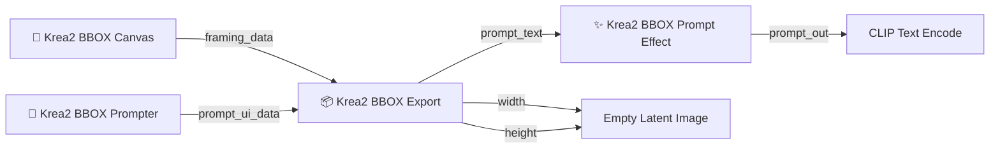

# Krea2 BBOX Prompter Suite

**Krea2 BBOX Prompter Suite** is a ComfyUI custom node suite for building Krea2 prompts from a visual BBOX layout.  
It separates **layout**, **per-region prompts**, **JSON export**, and **style/effect presets** so that Krea2 can receive a structured prompt with explicit object/text regions.

> Status: test / preview. The node is intended for workflow validation and iterative testing before public release.

---

## What this suite does

This suite lets you draw colored regions on a canvas, write prompts for each region, and export a compact structured JSON prompt for Krea2.

Main goals:

- Create BBOX-based layout prompts for Krea2.
- Separate object prompts from visible text prompts.
- Add optional framing hints such as `Full body`, `Upper body`, or `Bust-up`.
- Add optional style/effect prompt text through a thumbnail-based preset selector.
- Keep generated prompt output usable with standard `CLIP Text Encode` nodes.

---

## Included nodes

| Node | Role |
|---|---|
| `📐 Krea2 BBOX Canvas` | Draw and manage BBOX regions and latent size. |
| `📝 Krea2 BBOX Prompter` | Enter scene/background and per-color region prompts. |
| `📦 Krea2 BBOX Export` | Combine canvas + prompter data into final Krea2 JSON prompt. |
| `✨ Krea2 BBOX Prompt Effect` | Add optional style/effect preset text with thumbnail cards. |

Use **`✨ Krea2 BBOX Prompt Effect`** for this suite.  
Avoid older nodes named `✨ Krea2 Prompt Effect`, because that name may conflict with older Krea2 Camera Framing nodes.

---

## Basic connection chart



ASCII fallback:

```text
📐 Krea2 BBOX Canvas.framing_data
        ↓
📦 Krea2 BBOX Export.framing_data

📝 Krea2 BBOX Prompter.prompt_ui_data
        ↓
📦 Krea2 BBOX Export.prompt_ui_data

📦 Krea2 BBOX Export.prompt_text
        ↓
✨ Krea2 BBOX Prompt Effect.prompt_in
        ↓
✨ Krea2 BBOX Prompt Effect.prompt_out
        ↓
CLIP Text Encode.text

📦 Krea2 BBOX Export.width  → Empty Latent Image.width
📦 Krea2 BBOX Export.height → Empty Latent Image.height
```

Do **not** connect Canvas directly to Prompter.  
Prompter does not need `framing_data`; Export combines the two data streams.

---

## Installation

From your ComfyUI `custom_nodes` folder:

```powershell
cd D:\Codex\ComfyUI\custom_nodes
git clone https://github.com/ukr8b3g-cmyk/Krea2-BBOX-Prompter.git Krea2-BBOX-Prompter-Suite
```

If the folder already exists, update it instead:

```powershell
cd D:\Codex\ComfyUI\custom_nodes\Krea2-BBOX-Prompter-Suite
git pull
```

Then restart ComfyUI and hard refresh the browser if the old UI is still cached:

```text
Ctrl + F5
```

---

## Node usage

### 1. `📐 Krea2 BBOX Canvas`

Use this node to set canvas size and draw colored BBOX regions.

Main outputs:

```text
framing_data
```

Typical region colors:

```text
RED
BLUE
YELLOW
GREEN
MAGENTA
```

Each colored BBOX becomes one possible element in the final JSON.

### 2. `📝 Krea2 BBOX Prompter`

Use this node to write prompts for each colored region.

Fields:

- `SCENE / BACKGROUND`: whole-image scene context.
- `BACKGROUND`: environment/background context.
- Per-color prompt box.
- `Type`: `Object` or `Text`.
- `Framing`: optional composition hint.

Recommended `Type` usage:

| Type | Use for |
|---|---|
| `Object` | People, objects, locations, visual subjects. |
| `Text` | Visible text that should appear in the image. |

Recommended `Framing` values:

```text
Auto
Full body
Upper body
Bust-up
Headshot
Close-up
Lower body
Full object
Detail shot
Macro detail
```

`Auto` adds no extra framing text. Other choices append short composition guidance to object descriptions.

### 3. `📦 Krea2 BBOX Export`

Use this node to combine Canvas + Prompter data into the final structured Krea2 prompt.

Inputs:

```text
framing_data
prompt_ui_data
bbox_mode
skip_empty
output_format      # legacy-compatible
output_mode        # legacy-compatible
auto_position_hint
```

Outputs:

```text
prompt_text
width
height
```

Recommended settings:

```text
bbox_mode: normalized_1000
skip_empty: true
output_format: compact
output_mode: json_with_safety_hint
auto_position_hint: true
```

### 4. `✨ Krea2 BBOX Prompt Effect`

Use this node after Export to add optional style/effect prompt text.

Inputs:

```text
prompt_in
```

Outputs:

```text
prompt_out
```

Some versions may expose `effect_text` for legacy compatibility. Use `prompt_out` for actual generation.

The UI includes:

- Search box
- Category chips: `All`, `Photo`, `Art`, `Light`, `Mood`, `Custom`
- WebP thumbnail cards
- Enable toggle
- Custom preset area

`Custom` is user-controlled and should be blank by default. It only adds text when the user enters a custom effect prompt.

---

## Prompt writing rules

### Object prompt recommendation

Use longer, natural-language descriptions.

Good:

```text
A Japanese high school girl standing in a bright school hallway, wearing a navy school uniform with a red ribbon, shown in a clean portrait composition with soft daylight.
```

Avoid short label-like prompts, especially Japanese labels, unless they are intended to be visible text.

Risky:

```text
女子高校生
制服女子
男性
教室
猫
```

These short labels may be rendered as visible text by Krea2.

### Text prompt recommendation

Use `Type = Text` for visible writing.

Format:

```text
visible text | text appearance description
```

Example:

```text
こんにちは | medium-size Japanese greeting text with black outline, placed along the lower foreground
```

If the `|` description is omitted, the node uses a minimal readable text description.

---

## Output structure

The target prompt is compact JSON:

```json
{"aspect_ratio":"1:1","high_level_description":"...","compositional_deconstruction":{"background":"...","elements":[{"type":"obj","bbox":[...],"desc":"..."},{"type":"text","bbox":[...],"text":"...","desc":"..."}]}}
```

The goal is generation quality, not human-readable JSON formatting.

---

## Thumbnail system

Prompt Effect uses local WebP thumbnails.

```text
web/thumbnails/*.webp
web/thumbnails/manifest.json
```

Recommended thumbnail spec:

```text
Format: WebP
Source size: 192 x 128 px
Displayed width: about 80-92 px
Card width: about 100-112 px
External URL loading: no
```

The UI loads thumbnails from the local extension folder. If a thumbnail is missing, it falls back to a text/gradient card.

The current included thumbnails are provisional test assets for workflow validation. They can be replaced later with final generated assets as long as filenames remain stable.

---

## Technical notes

### Python node file

```text
nodes_element_framing.py
```

Defines:

```text
Krea2ElementFramingV1Canvas
Krea2ElementFramingV1Prompt
Krea2ElementJSONExportV1
Krea2BBOXPromptEffect
```

### Frontend file

```text
web/krea2_element_framing_v1.js
```

Responsibilities:

- Canvas UI
- Prompt UI
- Prompt Effect card UI
- Local WebP thumbnail loading
- Browser-side UI state handling

### Web directory registration

```python
WEB_DIRECTORY = './web'
```

This lets ComfyUI expose extension assets under `/extensions/Krea2-BBOX-Prompter-Suite/...`.

### Preset thumbnail manifest

```text
web/thumbnails/manifest.json
```

Each item should include:

```json
{
  "name": "35mm Film",
  "file": "35mm_film.webp",
  "category": "Photo",
  "chip": "Film",
  "tone": "film"
}
```

---

## Testing checklist

Run these checks before commit:

```powershell
python -m py_compile nodes_element_framing.py
node --check web/krea2_element_framing_v1.js
```

Manual ComfyUI checks:

```text
1. Start ComfyUI.
2. Add 📐 Krea2 BBOX Canvas.
3. Add 📝 Krea2 BBOX Prompter.
4. Add 📦 Krea2 BBOX Export.
5. Add ✨ Krea2 BBOX Prompt Effect.
6. Connect the nodes as shown in the chart.
7. Confirm that Prompt Effect thumbnails load.
8. Confirm that Custom tab is blank by default.
9. Confirm that prompt_out connects to CLIP Text Encode.text.
10. Queue one simple test generation.
```

---

## Known limitations

- Krea2 may render JSON metadata if the prompt is too short or label-like.
- Strong natural-language object descriptions are recommended.
- Local thumbnail assets are test-stage placeholders and can be replaced.
- Existing workflows using older `Krea2PromptEffect` may need to be migrated to `Krea2BBOXPromptEffect`.

---

## Repository target

Planned GitHub repository:

```text
https://github.com/ukr8b3g-cmyk/Krea2-BBOX-Prompter
```
